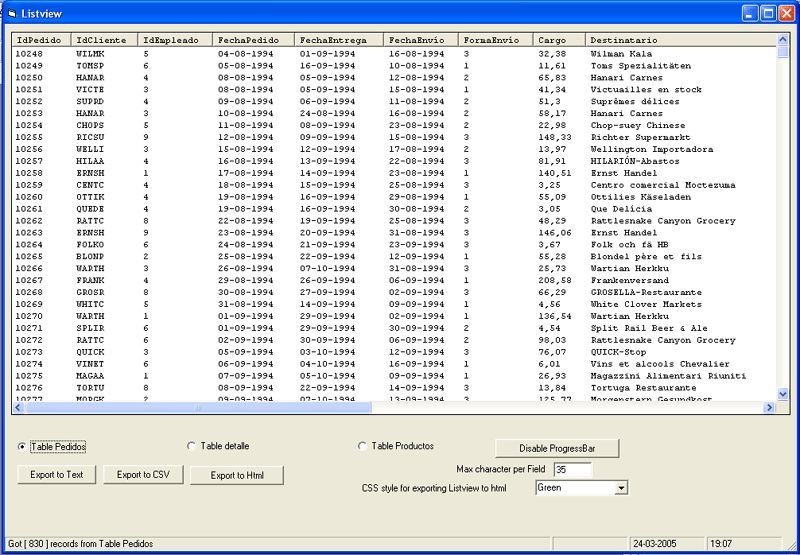



## c\_listview

### Description

Whith this class you can load a lisview control with a recorset, and export the data to the TXT, CSV and  HTML Format, you can use or not the progressbar.
 
### More Info
 

             |
---                |---
**Submitted On**   |2005-03-23 20:53:26
**By**             |[seMOnkey](https://github.com/Planet-Source-Code/PSCIndex/blob/master/ByAuthor/semonkey.md)
**Level**          |Intermediate
**User Rating**    |4.2 (25 globes from 6 users)
**Compatibility**  |VB 5\.0, VB 6\.0
**Category**       |[Databases/ Data Access/ DAO/ ADO](https://github.com/Planet-Source-Code/PSCIndex/blob/master/ByCategory/databases-data-access-dao-ado__1-6.md)
**World**          |[Visual Basic](https://github.com/Planet-Source-Code/PSCIndex/blob/master/ByWorld/visual-basic.md)
**Archive File**   |[c\_listview1867763242005\.zip](https://github.com/Planet-Source-Code/semonkey-c-listview__1-59628/archive/master.zip)

